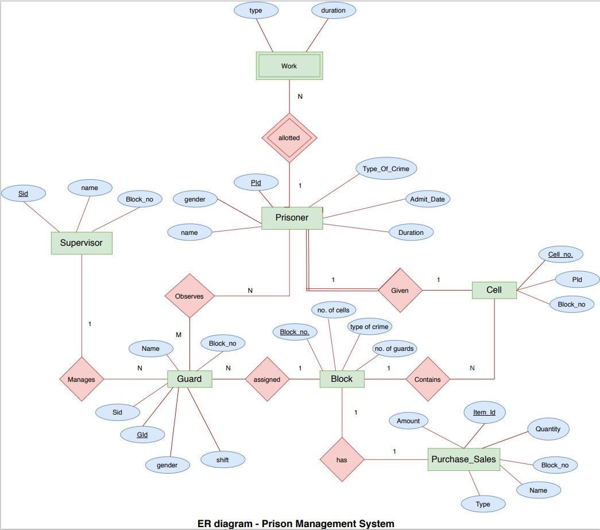

# Prison-Management-System
The Project is all about creating a database on the prison management system  which clearly gives the idea of the prison and its details and  information about the prisoners. In this database we can view and  update prisoner’s info and the entities related to it.
### The following information depicts all the points through which the database to be modelled :
* In prison the prisoner is registered through a prisoner id, 
address, gender, date of birth, type of crime committed. 

* There is in-out register through which Prisoners info has been 
maintained like when he is registered in the prison and when his 
punishment is over and also at which time in between bail has been 
provided. 
* There are number of blocks categorized on the basis of gender and 
type of crime committed, prisoner has been allotted a block 
number. 
* Every block has number of cells in which prisoners have been 
shifted. Each cell may have one or more than one prisoner inside it. 
* Also, some type of work has been allotted to the prisoners with 
specific number of hours a day and it is necessary that every 
prisoner must allotted some work. 
 
* Guards have been registered through guard id, gender, date of 
birth, phone number and address. 
* Each guard has been allotted a block and there can be more than 
one guard with same block number but each guard cannot have 
multiple block numbers. 
* Guards has been allotted the shift and duration of hours they have 
to work. 
* There is a supervisor of each block who has been registered 
through id number, gender and phone number. 
* Supervisor maintains the information about the block they are 
supervising which includes guard’s info that is number of guards in 
that block and also number of prisoners under his supervision. 
* Supervisor assigned the work to the prisoners and also maintains 
the purchase and sales info. 
 
* Supervisor also tracks the performance of the prisoners and on the 
basis of their performance grades them . 
## ER Diagram :

## Relational Table :

